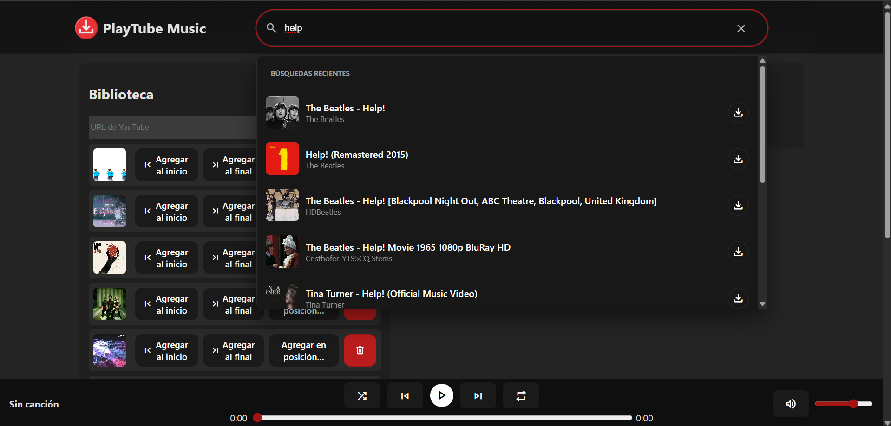
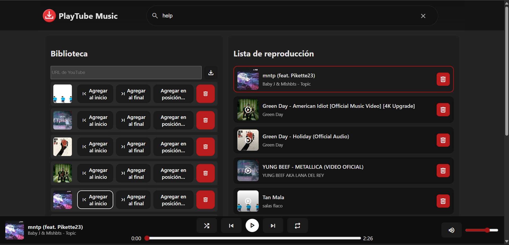
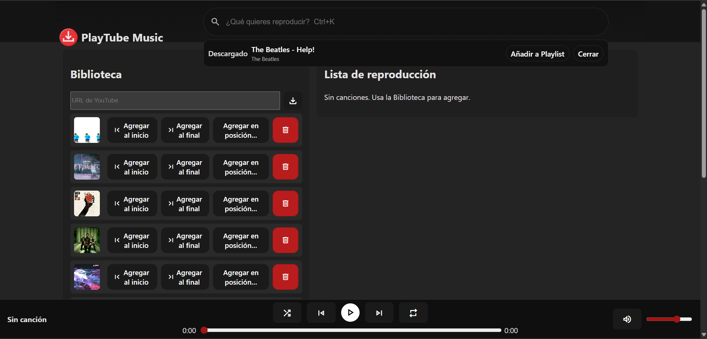

# PlayTube Music

> Reproductor y biblioteca musical con descarga desde YouTube. Frontend en React + Vite, backend en FastAPI. Inspirado en Spotify: búsqueda rápida, descarga con un clic y lista de reproducción gestionada con una doubly linked list.

## Características

- Búsqueda en YouTube con resultados instantáneos (yt-dlp)
- Descarga de audio con un clic y agregado a la biblioteca local
- Reproductor con play/pause, anterior/siguiente, progreso, volumen y mute
- Cola/playlist con inserción al inicio/final/posición específica (lista doble)
- Biblioteca persistente en `server/library.json`
- Servido de archivos estáticos desde `server/media/`
- UI cuidada: topbar, búsqueda tipo “pill”, estados de descarga y acciones inline

## 📸 Capturas de funcionamiento

### Búsqueda de canciones


### Biblioteca y playlists


### Reproducción en curso


## Requisitos

- Node.js 18+
- Python 3.10+
- Recomendado: FFmpeg (para convertir a MP3). Si no lo tienes, puedes permitir formatos originales.

## Instalación

1) Backend (Python)

```powershell
cd server
python -m venv .venv
.venv\Scripts\activate
pip install -r requirements.txt
# Para búsqueda y fallback (recomendado):
pip install yt-dlp
cd ..
```

2) Frontend (Node)

```powershell
npm install
```

## Arrancar frontend y backend juntos (dev)

Desde la raíz del proyecto:

```powershell
npm run dev
```

Esto levanta en paralelo:
- Backend: http://127.0.0.1:8000 (Uvicorn con reload)
- Frontend: http://127.0.0.1:5173 (Vite con proxy a `/api` y `/media`)

Notas (Windows / PowerShell):
- El script usa `cross-env` para definir `ENABLE_YTDLP_FALLBACK=1` en el backend; si pytube falla, se intenta `yt-dlp` (si está instalado).
- Si no tienes FFmpeg y no quieres instalarlo, puedo habilitar `ALLOW_NON_MP3=1` en el script para permitir WEBM/M4A en dev.

## Scripts útiles

```json
{
  "dev": "concurrently -n server,web -c \"magenta,cyan\" \"npm:dev:server\" \"npm:dev:client\"",
  "dev:client": "vite",
  "dev:server": "cross-env ENABLE_YTDLP_FALLBACK=1 python -m uvicorn server.main:app --reload --host 127.0.0.1 --port 8000",
  "build": "tsc -b && vite build",
  "preview": "vite preview"
}
```

- Config de proxy de Vite: ver `vite.config.ts` (redirige `/api` y `/media` al backend)

## API (resumen)

- GET `/api/library` → lista la biblioteca (Track[])
- POST `/api/download` { url } → descarga el audio y lo agrega a la biblioteca (devuelve Track)
- DELETE `/api/library/{filename}` → elimina un archivo de la biblioteca
- Estáticos: `/media/<archivo>` → sirve los audios descargados

Tipos principales (frontend `src/types.ts`):

- Track: `{ id, title, author?, duration?, filename, src, thumbnail? }`
- SearchItem: `{ id, title, author?, duration?, url, thumbnail? }`

## Estructura del proyecto

```
my-app/
  server/
    main.py         # FastAPI: endpoints /api y estáticos /media
    media/          # Archivos descargados (ignorado por git)
    library.json    # Índice de biblioteca (ignorado por git)
    requirements.txt
  src/
    components/     # UI (SearchBar, Library, Playlist, PlayerBar)
    lib/            # Lógica (PlayerStore, PlaylistManager, DoublyLinkedList)
    api.ts          # Cliente REST del backend
    config.ts       # Base URL (vacía en dev, usa proxy de Vite)
  vite.config.ts    # Proxy /api y /media → 8000
  package.json      # Scripts dev/build
```

## Configuración y entorno

- `ENABLE_YTDLP_FALLBACK=1`: si pytube falla, intenta `yt-dlp` (debes tenerlo instalado en el entorno del server)
- `ALLOW_NON_MP3=1`: permite saltar la conversión a MP3 si no tienes FFmpeg (útil en dev). Puedo dejarlo en los scripts si lo prefieres.
- `API_BASE` (frontend): vacío en dev (usa proxy). Para producción, configura el dominio del backend si difiere.

## Solución de problemas

- Error “Se requiere 'yt-dlp' para buscar” → `cd server && pip install yt-dlp`
- Error sobre FFmpeg no instalado → instala FFmpeg (winget) o usa `ALLOW_NON_MP3=1` (dev)
- `npm run dev` falla → ejecuta `npm install` para instalar `concurrently` y `cross-env`
- Uvicorn no encontrado → `cd server && pip install -r requirements.txt`
- CORS en dev → ya hay proxy en Vite; no deberías verlo. Revisa `vite.config.ts`.

## Despliegue

- Frontend: Vercel/Netlify/Cloudflare Pages (necesitarás apuntar a un backend público y ajustar `API_BASE`/proxy)
- Backend: Render/Railway/Fly.io. Necesitarás `yt-dlp` y FFmpeg instalados en el contenedor/instancia.
